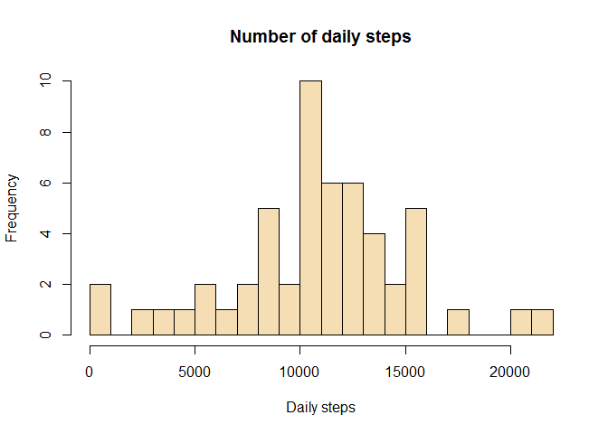
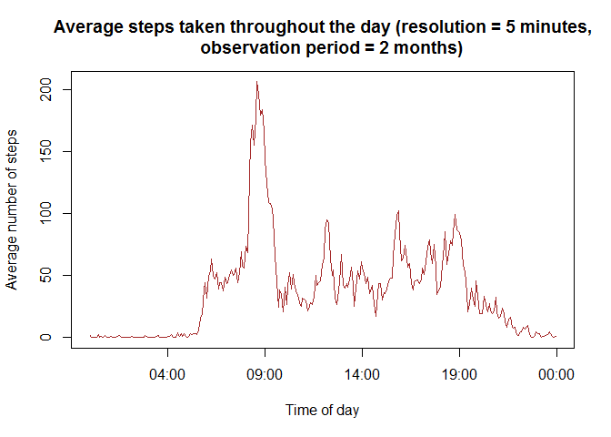
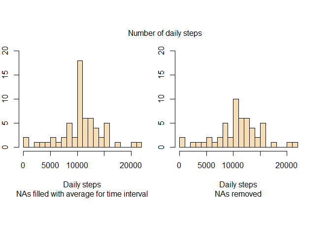
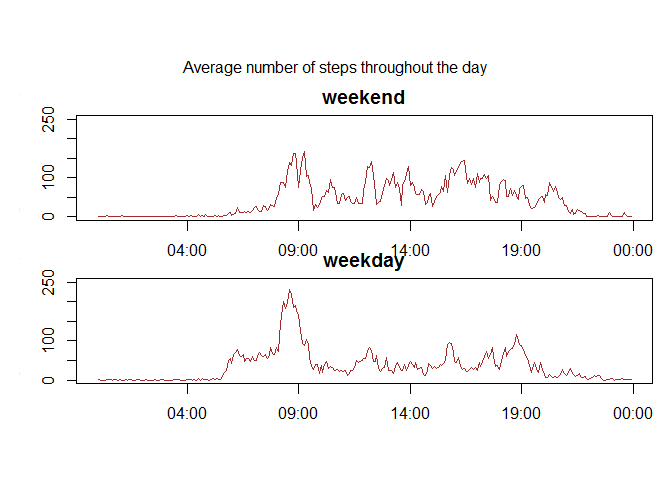

# Reproducible Research: Peer Assessment 1


## Initial setup:
We are assuming that the working directory is *./RepData_PeerAssessment1/* as
cloned from GitHub.  
We are going to first unzip the *activity.zip* file in-situ:

```r
unzip("activity.zip")
```

The computer used to build this analysis is using Windows in French. To output dates (and especially weekdays) in English, we need to change the system 
locales:


```r
Sys.setlocale("LC_TIME", "English")
```

```
## [1] "English_United States.1252"
```


## Loading and preprocessing the data
The data in the file looks tidy and the data loading is straightforward. However we need to tell R to convert the date strings into the *Date* class:


```r
activity <- read.csv("activity.csv", colClasses = c("numeric", "Date", 
                                                   "numeric"))
```

Additionally, the *interval* column's format is difficult to exploit as it is. We are going to convert it to a more natural format:


```r
activity$interval <- formatC(activity$interval, width = 4, 
                                  format = "d", flag = "0")
activity$interval <- as.POSIXct(activity$interval, tz = "GMT", 
                                format = "%H%M")
```

A quick scan though the data confirms that it has loaded correctly in a usable
format.


```r
str(activity)
```

```
## 'data.frame':	17568 obs. of  3 variables:
##  $ steps   : num  NA NA NA NA NA NA NA NA NA NA ...
##  $ date    : Date, format: "2012-10-01" "2012-10-01" ...
##  $ interval: POSIXct, format: "2015-11-10 00:00:00" "2015-11-10 00:05:00" ...
```

```r
summary(activity)
```

```
##      steps             date               interval                  
##  Min.   :  0.00   Min.   :2012-10-01   Min.   :2015-11-10 00:00:00  
##  1st Qu.:  0.00   1st Qu.:2012-10-16   1st Qu.:2015-11-10 05:58:45  
##  Median :  0.00   Median :2012-10-31   Median :2015-11-10 11:57:30  
##  Mean   : 37.38   Mean   :2012-10-31   Mean   :2015-11-10 11:57:30  
##  3rd Qu.: 12.00   3rd Qu.:2012-11-15   3rd Qu.:2015-11-10 17:56:15  
##  Max.   :806.00   Max.   :2012-11-30   Max.   :2015-11-10 23:55:00  
##  NA's   :2304
```

Note the numerous *NA*s in *steps*. We will deal with them later. Note also that over 50% of the recordings (5-minute windows) have 0 steps (median = 0)
.

## What is mean total number of steps taken per day?

To answer this question, we are first going to build a histogram showing the frequency (number of days) for different value buckets for *steps*.


```r
# First split the data by day:
perDay <- split(activity$steps, activity$date)

# Sum up each element of the resulting list and simplify into a vector:
perDay <- sapply(perDay, sum)

# Build the histogram:
hist(perDay, breaks = 24, main = "Number of daily steps", xlab = "Daily steps"
     , col = "wheat")
```

 

Note that the mode is between 10 and 11K steps per day.  
Now let us calculate the mean and median, ignoring *NA*s for now:


```r
mean(perDay, na.rm = TRUE)
```

```
## [1] 10766.19
```

```r
median(perDay, na.rm = TRUE)
```

```
## [1] 10765
```

These values are very close to each other and to the mode as well, hinting at a reasonably symetric distribution.


## What is the average daily activity pattern?

In the dataset, each daily 5-minute interval is identified with the time of the day coded from 0 to 2355, indicating the hour and minute of the day when the interval begins. We will use this to split the data set and average the values (still ignoring any *NA*s).  


```r
perInterval <- split(activity$steps, activity$interval)
perInterval <- sapply(perInterval, mean, na.rm = TRUE)
perIntervalDf <- data.frame(interval = as.POSIXct(names(perInterval), 
                                                  format = "%Y-%m-%d %H:%M",
                                                  tz = "GMT"), 
                            avgSteps = perInterval)
```

We are now ready to plot the time series:


```r
with(perIntervalDf, (plot(interval, avgSteps, type = "l", 
    main = "Average steps taken throughout the day (resolution = 5 minutes,
    observation period = 2 months)",
    xlab = "Time of day", ylab = "Average number of steps", col = "brown")))
```

 

```
## NULL
```

From this plot, it looks like on average, activity is highest shortly after 8am. Let us confirm this by computing the 5-minute interval with the highest average number of steps:


```r
maxSteps <- perIntervalDf$interval[which.max(perIntervalDf$avgSteps)]
maxSteps <- format(maxSteps, format = "%H:%M:%S", tz = "GMT")
maxSteps
```

```
## [1] "08:35:00"
```

The 5-minute interval with the highest average number of steps is from 08:35:00.

## Inputing missing values

First let us confirm that missing values are **only** found in the *steps* column of our data frame and count these *NA*s:


```r
sum(is.na(activity)) == sum(is.na(activity$steps))
```

```
## [1] TRUE
```

```r
sum(is.na(activity$steps))
```

```
## [1] 2304
```

To fill these missing values, we are going to assign to them the average number of steps for these 5-minute intervals over the whole observation period. We have calculated these averages in the previous section.


```r
# Build a new data frame that will identify the position of the NAs in activity
missingValIntervals <- data.frame(NAindices = which(is.na(activity$steps)),
                                  NAintervals = 
                                      activity$interval[is.na(activity$steps)])

# Add a column where we retrieve the average steps for each interval
missingValIntervals$NAsteps <-
    perIntervalDf$avgSteps[match(missingValIntervals$NAintervals, 
                               perIntervalDf$interval)]

# Use this data frame to populate a copy of the original data frame activity:
activityComplete <- activity
activityComplete$steps[missingValIntervals$NAindices] <-
                                                missingValIntervals$NAsteps

# Free up memory
rm(missingValIntervals)
```

To compare the patterns with and without filling missing values, we will display both histograms side by side:


```r
# First split the data by day:
perDayComplete <- split(activityComplete$steps, activityComplete$date)

# Sum up each element of the resulting list and simplify into a vector:
perDayComplete <- sapply(perDayComplete, sum)

# Build the histograms with identical scales:
par(mfrow = c(1, 2), oma = c(4, 1, 4, 1), mar = c(5, 1, 1, 2))
hist(perDayComplete, breaks = 24, ylim = c(0, 20), main = NULL,
     sub = "NAs filled with average for time interval", xlab = "Daily steps",
     col = "wheat")
hist(perDay, breaks = 24, ylim = c(0, 20), sub = "NAs removed", 
     main = NULL, xlab = "Daily steps", col = "wheat" )
mtext("Number of daily steps", outer = TRUE)
```

 

The main difference seems to be an increase of the mode's number of steps. This is hardly surprising since we noticed that the mode is close to the average, and we populated all NAs with averages accross all days.
Let us look at the main and median again. As a reminder, these values for the original table were:


```r
mean1 <- mean(perDay, na.rm = TRUE)
median1 <- median(perDay, na.rm = TRUE)

mean1
```

```
## [1] 10766.19
```

```r
median1
```

```
## [1] 10765
```

With the NAs filled with average steps for each interval, these value have remained almost identical. Mean and median are now equal:


```r
mean2 <- mean(perDayComplete, na.rm = TRUE)
median2 <- median(perDayComplete, na.rm = TRUE)

mean2
```

```
## [1] 10766.19
```

```r
median2
```

```
## [1] 10766.19
```


## Are there differences in activity patterns between weekdays and weekends?

For this we will create a factor indicating whether each day in the sample is a week day or a week end. We will then split the data frame in two using this distinction.
We will then use *tapply* on each of the resulting data frames to compute the mean for each value of *interval*.


```r
# First create a factor for weekdays / weekends and add the information to our data frame:
weekFct <- factor(levels = c("weekday", "weekend"))
weekFct[weekdays(activityComplete$date) == "Saturday" | 
            weekdays(activityComplete$date) == "Sunday"] <- "weekend"
weekFct[weekdays(activityComplete$date) != "Saturday" & 
            weekdays(activityComplete$date) != "Sunday"] <- "weekday"
activityComplete <- cbind(activityComplete, weekFct)

# Now split the data frame by weekday/weekend and interval, and calculate average steps for each:
weekDays <- activityComplete[activityComplete$weekFct == "weekday", ]
weekEnds <- activityComplete[activityComplete$weekFct == "weekend", ]

perIntervalWD <- tapply(weekDays$steps, weekDays$interval, mean)
perIntervalWD_df <- data.frame(interval = as.POSIXct(names(perIntervalWD), 
                                                  format = "%Y-%m-%d %H:%M",
                                                  tz = "GMT"), 
                            avgSteps = perIntervalWD)

perIntervalWE <- tapply(weekEnds$steps, weekEnds$interval, mean)
perIntervalWE_df <- data.frame(interval = as.POSIXct(names(perIntervalWE), 
                                                  format = "%Y-%m-%d %H:%M",
                                                  tz = "GMT"), 
                            avgSteps = perIntervalWE)
```

We can now build the pannel plot:


```r
# Prepare the plotting area:
panels <- rbind(c(1), c(2))
layout(panels)
par(mar = c(1, 3, 2, 0), oma = c(4, 1, 4, 1))

# Plot:
with(perIntervalWE_df, (plot(interval, avgSteps, type = "l", 
    main = "weekend", ylim = c(0, 250),
    xlab = "Time of day", ylab = "Average number of steps", col = "brown")))
```

```
## NULL
```

```r
with(perIntervalWD_df, (plot(interval, avgSteps, type = "l", 
    main = "weekday", ylim = c(0, 250),
    xlab = "Time of day", ylab = "Average number of steps", col = "brown")))
```

```
## NULL
```

```r
mtext("Average number of steps throughout the day", outer = TRUE)
```

 

As we would expect from intuition, activity during week days is much more concentrated around commute periods, whereas on week-ends, it is more regularly  spread out throughout the day.
Week-end activity also starts later in the morning and ends later at night.
